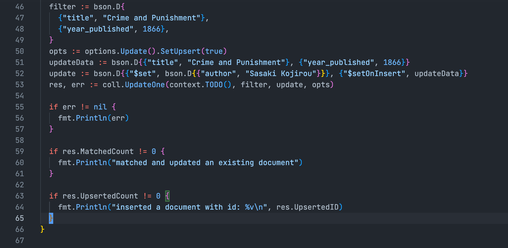

#### Requirement

We want to insert a new document if none of the documents match provided filter, but update only specific field when a match is found.

#### Current state of `favorite_books` collection

```go
{  "_id": {    "$oid": "6294228d3811a7c4c5044808"  },  "title": "My Brilliant Friend",  "author": "Elena Ferrante",  "year_published": 2012}
{  "_id": {    "$oid": "6294228d3811a7c4c5044809"  },  "title": "Lucy",  "author": "Jamaica Kincaid",  "year_published": 2002}
{  "_id": {    "$oid": "6294228d3811a7c4c504480a"  },  "title": "Cat's Cradle",  "author": "Kurt Vonnegut Jr.",  "year_published": 1998}
```

#### Connect to database

```go
const uri = "mongodb://localhost:27017/?maxPoolSize=20&w=majority"
client, err := mongo.Connect(context.TODO(), options.Client().ApplyURI(uri))

if err != nil {
	panic(err)
}
defer func() {
	if err = client.Disconnect(context.TODO()); err != nil {
		panic(err)
	}
}()
```

#### Insert or Update

```go
coll := client.Database("myDB").Collection("favorite_books")
filter := bson.D{
	{"title", "Lucy"},
	{"year_published", 1866},
}
opts := options.Update().SetUpsert(true)
updateData := bson.D{{"title", "Crime and Punishment"}, {"year_published", 1866}}
update := bson.D{{"$set", bson.D{{"author", "Fyodor Dostoyevsky"}}}, {"$setOnInsert", updateData}}
res, err := coll.UpdateOne(context.TODO(), filter, update, opts)

if err != nil {
	fmt.Println(err)
}

if res.MatchedCount != 0 {
	fmt.Println("matched and updated an existing document")
}

if res.UpsertedCount != 0 {
	fmt.Println("inserted a document with id: %v\n", res.UpsertedID)
}
```

From the mongodb docs,

> An upsert performs one of the following actions:
>
> - Update documents that match your query filter
> - Insert a document if there are no matches to your query filter

There is no document where `title` is Lucy and `year_published` is 1866, so the above code inserts a new document and the state of the collection changes to:

```go
{  "_id": {    "$oid": "6294228d3811a7c4c5044808"  },  "title": "My Brilliant Friend",  "author": "Elena Ferrante",  "year_published": 2012}
{  "_id": {    "$oid": "6294228d3811a7c4c5044809"  },  "title": "Lucy",  "author": "Jamaica Kincaid",  "year_published": 2002}
{  "_id": {    "$oid": "6294228d3811a7c4c504480a"  },  "title": "Cat's Cradle",  "author": "Kurt Vonnegut Jr.",  "year_published": 1998}
{  "_id": {    "$oid": "629424222932d1cc570ad0d0"  },  "title": "Crime and Punishment",  "year_published": 1866,  "author": "Fyodor Dostoyevsky"}
```

If we change the filter to

```go
filter := bson.D{
	{"title", "Crime and Punishment"},
	{"year_published", 1866},
}
```

there is a document that match this query filter, hence we can update a specific field with the line

```go
update := bson.D{{"$set", bson.D{{"author", "Sasaki Kojirou"}}}, {"$setOnInsert", updateData}}
```

We then get the following collection:

```go
{  "_id": {    "$oid": "6294228d3811a7c4c5044808"  },  "title": "My Brilliant Friend",  "author": "Elena Ferrante",  "year_published": 2012}
{  "_id": {    "$oid": "6294228d3811a7c4c5044809"  },  "title": "Lucy",  "author": "Jamaica Kincaid",  "year_published": 2002}
{  "_id": {    "$oid": "6294228d3811a7c4c504480a"  },  "title": "Cat's Cradle",  "author": "Kurt Vonnegut Jr.",  "year_published": 1998}
{  "_id": {    "$oid": "629424222932d1cc570ad0d0"  },  "title": "Crime and Punishment",  "year_published": 1866,  "author": "Sasaki Kojirou"}
```

**Note:** Beware that field operators `$set` and `$setOnInsert` shouldn't have same fields since it would throw write exception.

#### Reference

- [Insert or Update in a single operation](https://www.mongodb.com/docs/drivers/go/current/fundamentals/crud/write-operations/upsert/)
- [setOnInsert](https://www.mongodb.com/docs/manual/reference/operator/update/setOnInsert/)
