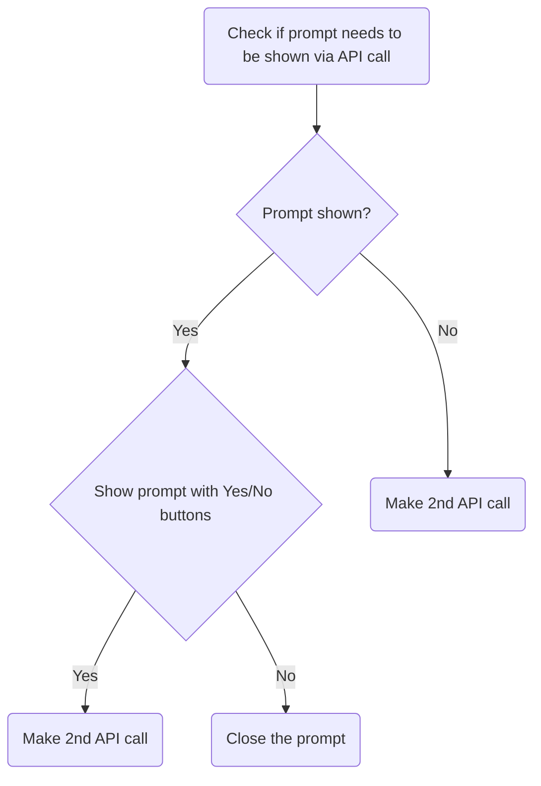

#### Scenario

If the description made you more confused about what this is actually about, here's a flowchart
diagram for you:



#### Usecase

You're trying to create a Company.If a company name already exists, users should be warned that
the company name already exists and do they really want to proceed with the same name. Company won't be created
if user chooses to cancel the prompt but, company with same name will be created if user chooses to proceed.

#### Implementation

Let's look at some react code to see how you might go on implementing this:

```jsx
const [createCompanyResolver, setCreateCompanyResolver] = useState<{
    resolve: null | ((value: boolean | PromiseLike<boolean>) => void);
  }>({
    resolve: null,
  });
```

Here, `createCompanyResolver` is a state that will be used to resolve the promise that will be created when the prompt is shown.

```jsx
try {
    const exists = await checkCompanyNameExists(companyName);

    if (exists) {
        // Show prompt with warning
        ...

        const createCompany = new Promise<boolean>((resolve) => {
          setCreateCompanyResolver({ resolve });
        });

        // Await for user to confirm if they want to create company
        const shouldCreateCompany = await createCompany;
        if (!shouldCreateCompany) {
          return;
        }
    }
}
```

The value of `createCompany` will be resolved based on whether the user chooses to proceed (true) or cancel(false) the prompt.

```jsx
    <WarningModal
        ...
        onUserAction={(proceed) => {
            if (createCompanyResolver.resolve) {
                createCompanyResolver.resolve(proceed);
            }
        }}
        ...
    />
```
