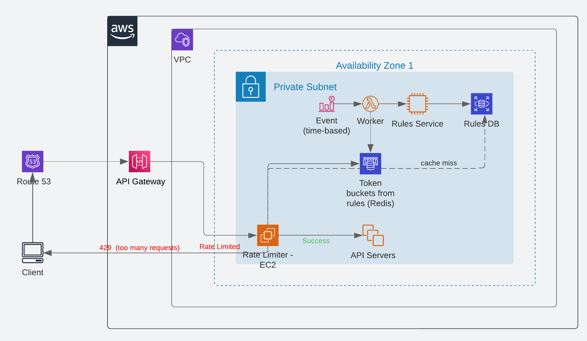
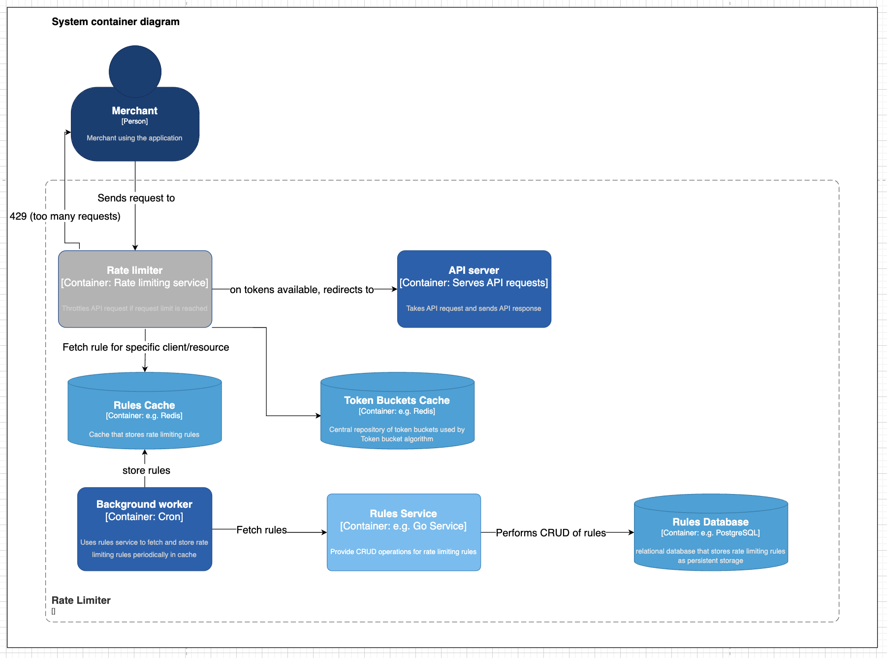
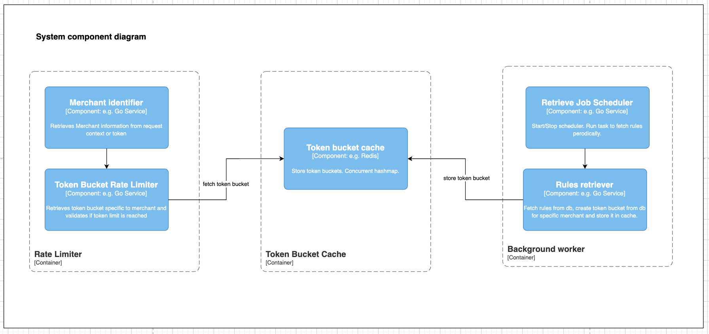
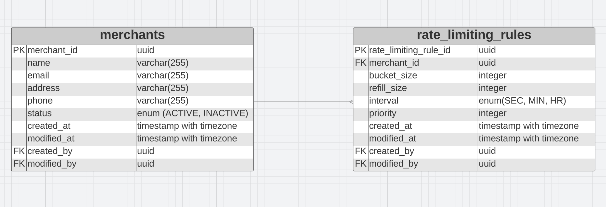
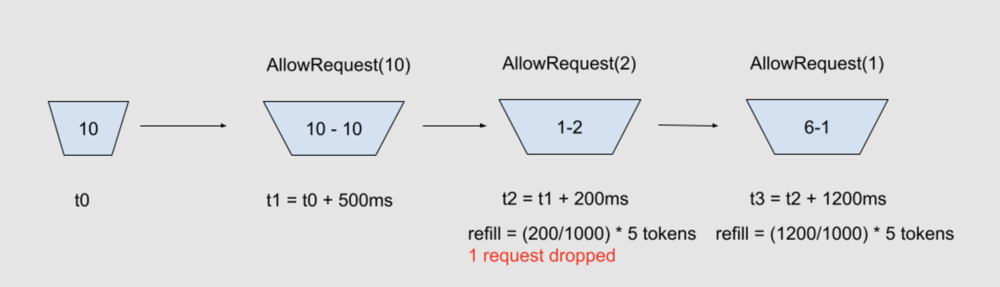
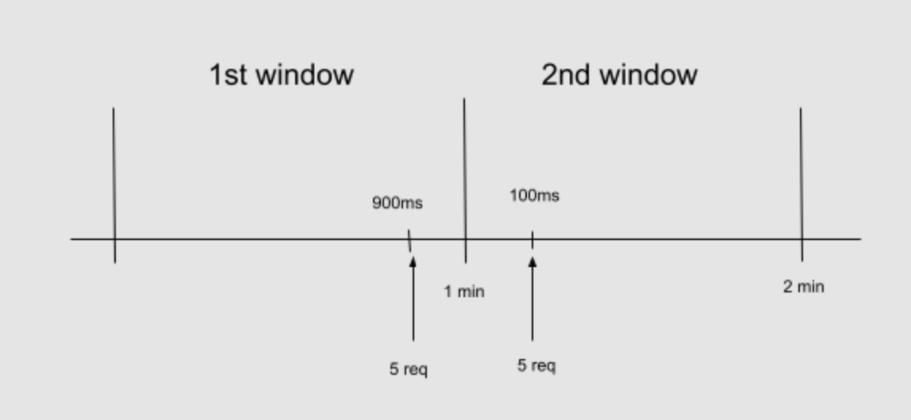

#### Introduction

“A rate limiter caps how many requests a sender can issue in a specific time window. It then blocks requests once the cap is reached.”

Some major reasons why we need rate limiting:

- To protect against misbehaving clients, DOS attacks, bruteforce attempts etc.
- Encourages developers to follow good coding practices
- Helps keep resource cost under control
- To increase availability of service for everyone
- Could be a revenue tactic for some services

#### System Architecture



Fig: Rate limiter using Token bucket algorithm



Fig: Container diagram for rate limiter



Fig: Component diagram for rate limiter

#### ERD



Fig: ER diagram showing relationship between merchants and their rate limiting rules

#### Overview of proposed Rate Limiter

From the above ER diagram, we are storing one or more rate limiting rules per merchant which may have different
priorities. Each merchant will be identified by an unique merchant id. Rate limits will be applied such that a
rule with higher priority is chosen for a merchant.

Also, this implementation provides Rules service which exposes APIs for administrators to manage rules
for each merchant.

For the implementation of Rate Limiter, Token bucket algorithm is used. This algorithm inherently handles
traffic bursts. This algorithm uses the concept of tokens in buckets. Empty bucket means upcoming
requests will be throttled until it is refilled. For its parameters, we provide bucket size or burst
size and refill rate. For the use case to handle traffic bursts, it’s advised to provide higher bucket
size than the refill rate.

#### Token Bucket Algorithm

The token bucket algorithm is a simple and popular mechanism for rate limiting that supports traffic bursts.
Three major components of this algorithm are Bucket, Token and Refill rate. Bucket is a container that
holds a certain number of tokens and bucket size signifies the burst capacity. Token represents the permission
to process the request. Refill rate is the rate at which tokens are added to the bucket.

Let’s look at some Go code for implementing the token bucket algorithm. It assumes a refill rate of n tokens
per second for brevity.

```go
package main

import (
  "sync"
  "time"
)

type TokenBucket struct {
  maxTokens  int64 // Bucket or burst size
  fillRate   int64 // n tokens per second for brevity
  curTokens  int64
  lastRefill time.Time
  mutex      sync.Mutex
}

func NewTokenBucket(maxTokens, fillRate int64) *TokenBucket {
  return &TokenBucket{
    maxTokens:  maxTokens,
    fillRate:   fillRate,
    curTokens:  maxTokens, // Initially filled with max tokens
    lastRefill: time.Now(),
    mutex:      sync.Mutex{},
  }
}

func (bucket *TokenBucket) AllowRequest(tokens int) bool {
  // Use lock to prevent race conditions while updating token size
  bucket.mutex.Lock()
  defer bucket.mutex.Unlock()
  bucket.refill()

  if bucket.curTokens >= tokens {
    bucket.curTokens -= tokens
    return true
  }
  return false
}

func (bucket *TokenBucket) refill() {
  now := time.Now()
  elapsed := now.Sub(bucket.lastRefill)
  tokensToAdd := int64(elapsed / time.Second) * bucket.fillRate

  // Ensure bucket doesn't overflow
  bucket.curTokens = min(bucket.curTokens+tokensToAdd, bucket.maxTokens)
  bucket.lastRefill = now
}

func min(a, b int64) int64 {
  if a < b {
    return a
  }
  return b
}
```

Let's look at an example on how traffic bursts are handled by this algorithm. Let’s assume the bucket
size is 10 and refill rate is 5 per second.



Fig: Traffic burst in Token bucket algorithm

- Bucket is initialised with max token size of 10
- 10 Requests worth of 10 tokens arrive simultaneously after 500 milliseconds causing the token size to deplete to 0
- Next 2 requests come after 200 milliseconds. 200 milliseconds wait is worth 1 token since rate of refill is 5 tokens per seconds. 1 token is sent for processing while another token is dropped
- Similarly, another request arrives after 1200 milliseconds wait which refills bucket with 6 tokens
- After this, requests are processed in steady rate of 5 requests per second until another traffic burst

#### Storing token buckets

Every time a background job is run, it fetches the rules for a chunk of merchants, creates bucket objects
from the rules and stores it in some in-memory cache like redis. Merchant id can be used as a key for each
bucket. With minimum overhead, Rate limiter can access the bucket for a specific merchant when the merchant
makes a transaction request.

Assuming millions of merchants exist in the system. Should we keep a bucket for each of them in the cache?
No. Buckets will have some expiration time and will be deleted if no requests are using the bucket for more
than refill rate. New bucket is created by the Rate limiter if the bucket is not found in cache for that
merchant.

#### Distributed Rate Limiter and its challenges

We can horizontally scale the rate limiter hosted in EC2 using Auto scaling group (ASG) and Load balancer.
When the load on rate limiter increases ASG scales out EC2 instances to match an increased load or scale
in to match decreased load. It automatically registers new instances to load balancer. Load balancer (LB)
is responsible for spreading load across multiple rate limiter instances.

Distributed environment brings few challenges. Assuming we will be maintaining a bucket cache in each host,
how many tokens should be assigned for each bucket of a merchant? Each bucket should be assigned the max number
of tokens it can store. Because in theory, all requests could land in the same host. In reality though,
most requests will probably be distributed to different hosts by LB.

So, how do we make sure that distributed requests do not consume more tokens than the bucket size?
To solve this problem, we should allow each host to talk to each other and share how many tokens
each host consumed altogether. Each host will subtract the sum collected from all the other hosts to get remaining
tokens.There’s still a chance that our system may be processing more requests than expected when all
requests arrive at the same time in each host and are unable to talk to each other.

There are few ways we can make each host talk to each other. Some popular message broadcasting ways are
consensus algorithms like paxos or raft, full mesh broadcasting - where each host is connected to
every other host. These are complex to implement, consumes huge network and storage resources. The simplest and
most popular way would be to use a central cache repository shared by all the hosts.

#### Comparison with other algorithms

##### Fixed window algorithm

It divides time into fixed-size windows and counts the number of requests in the current window.If the count exceeds the allowed limit, further requests are denied until the next window.

Although easy to implement, it cannot handle traffic bursts. Also, when requests arrive at the edges of two consecutive windows, the rate limit exceeds the applied rate limit rules.



Fig: Fixed window algorithm

Let’s say there’s a rule that says requests should be dropped if the number of requests exceeds 5 requests per minute. In the fixed window algorithm, 5 requests arrive at 900ms of the first window - it is sent for processing. In another window, the request counter is reset and another 5 requests arrive after 100ms. These requests are sent for processing as well. Two chunks of requests arrived within a period of 200ms and 10 requests were sent for processing within the period. This far exceeds the rate limit rule we’ve set.

##### Sliding window algorithm

It is similar to Fixed Window but uses a sliding window to smooth out the boundary effects. The window slides over time and counts requests within the current window span. It is more accurate than the fixed window algorithm but is more complex to implement. Since it requires maintaining timestamps for each request, more storage and computation power is required.

#### Rate limiting by IP vs User

The issue with rate limiting by IP is that multiple users may share the same public IP address for example in places like cafe or smartphone users using the same internet gateway. One bad user may cause throttling for other users. Also, people using IPV6 have options to use multiple IPs from a single computer making it hard to track them.

Authenticated user’s token can be used to track the user and rate limit their requests. Weakness of this type of rate limiting might be that hackers may DOS attack against a specific user by entering wrong credentials.

We could take an approach where we use both IP and user token to track the user. Though, this approach will require more storage.

#### Testing the efficiency of rate limiter

We can use load testing tools like Locust to simulate different traffic scenarios like steady and burst. Next step would be to monitor and measure different metrics to validate if the rate limiter is working as expected. Following may be some of the metrics that need attention:

- Throughput: Number of requests per set interval for each merchant
- Error Rate: Number of requests denied
- CPU and memory usage by rate limiter and API services
